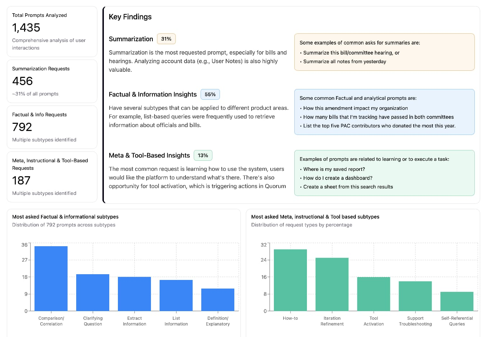

# 🖼️ Image Caption Components

This document explains how to use the componentized image caption system in your portfolio projects.

## Basic Usage

### Default Image Caption
```html
<figcaption class="image-caption">
    Dashboard tracking user interactions with conversational AI, revealing patterns in prompt usage.
</figcaption>
```
**Output:** **Image:** Dashboard tracking user interactions with conversational AI, revealing patterns in prompt usage.

## Caption Type Variants

### Chart Caption
```html
<figcaption class="image-caption image-caption--chart">
    User engagement metrics over time showing peak usage patterns.
</figcaption>
```
**Output:** **Chart:** User engagement metrics over time showing peak usage patterns.

### Diagram Caption
```html
<figcaption class="image-caption image-caption--diagram">
    System architecture showing data flow between components.
</figcaption>
```
**Output:** **Diagram:** System architecture showing data flow between components.

### Screenshot Caption
```html
<figcaption class="image-caption image-caption--screenshot">
    User interface showing the new dashboard layout.
</figcaption>
```
**Output:** **Screenshot:** User interface showing the new dashboard layout.

### Prototype Caption
```html
<figcaption class="image-caption image-caption--prototype">
    Interactive prototype demonstrating the user flow.
</figcaption>
```
**Output:** **Prototype:** Interactive prototype demonstrating the user flow.

### Wireframe Caption
```html
<figcaption class="image-caption image-caption--wireframe">
    Initial wireframes exploring different layout options.
</figcaption>
```
**Output:** **Wireframe:** Initial wireframes exploring different layout options.

### Mockup Caption
```html
<figcaption class="image-caption image-caption--mockup">
    High-fidelity mockup of the final design.
</figcaption>
```
**Output:** **Mockup:** High-fidelity mockup of the final design.

### User Flow Caption
```html
<figcaption class="image-caption image-caption--flow">
    User journey mapping showing the complete experience.
</figcaption>
```
**Output:** **User Flow:** User journey mapping showing the complete experience.

### Research Caption
```html
<figcaption class="image-caption image-caption--research">
    User research findings and insights from interviews.
</figcaption>
```
**Output:** **Research:** User research findings and insights from interviews.

### Data Caption
```html
<figcaption class="image-caption image-caption--data">
    Analytics dashboard showing key performance metrics.
</figcaption>
```
**Output:** **Data:** Analytics dashboard showing key performance metrics.

## Size Variants

### Small Caption
```html
<figcaption class="image-caption image-caption--small">
    Brief description for smaller images.
</figcaption>
```

### Large Caption
```html
<figcaption class="image-caption image-caption--large">
    More detailed description for prominent images.
</figcaption>
```

## Alignment Variants

### Left-Aligned Caption
```html
<figcaption class="image-caption image-caption--left">
    Caption aligned to the left.
</figcaption>
```

### Right-Aligned Caption
```html
<figcaption class="image-caption image-caption--right">
    Caption aligned to the right.
</figcaption>
```

## Style Variants

### Non-Italic Caption
```html
<figcaption class="image-caption image-caption--no-italic">
    Caption without italic styling.
</figcaption>
```

### Bold Caption
```html
<figcaption class="image-caption image-caption--bold">
    Caption with bold text.
</figcaption>
```

## Source Attribution

### Caption with Source
```html
<figcaption class="image-caption image-caption--with-source" data-source="User Research Study, 2024">
    User interview insights from the discovery phase.
</figcaption>
```
**Output:** **Image:** User interview insights from the discovery phase. (Source: User Research Study, 2024)

## Combining Multiple Classes

You can combine multiple classes for more specific styling:

```html
<figcaption class="image-caption image-caption--data image-caption--large image-caption--left image-caption--no-italic">
    Comprehensive analytics showing user behavior patterns across different segments.
</figcaption>
```

## Complete Example

```html
<div class="image-container">
    <figcaption class="image-caption image-caption--chart image-caption--large">
        Dashboard tracking user interactions with conversational AI, revealing patterns in prompt usage.
    </figcaption>
    <div class="image-wrapper" data-zoom="true">
        
        <div class="image-overlay">
            <button class="zoom-btn" title="Click to zoom">🔍</button>
        </div>
    </div>
</div>
```

## Available Classes Summary

### Type Classes
- `image-caption--chart`
- `image-caption--diagram`
- `image-caption--screenshot`
- `image-caption--prototype`
- `image-caption--wireframe`
- `image-caption--mockup`
- `image-caption--flow`
- `image-caption--research`
- `image-caption--data`

### Size Classes
- `image-caption--small`
- `image-caption--large`

### Alignment Classes
- `image-caption--left`
- `image-caption--right`

### Style Classes
- `image-caption--no-italic`
- `image-caption--bold`
- `image-caption--with-source`

## Best Practices

1. **Choose the most appropriate type** for your content
2. **Use size variants** to match the importance of the image
3. **Consider alignment** based on your layout needs
4. **Add source attribution** when using external images or data
5. **Keep descriptions concise** but informative
6. **Combine classes thoughtfully** to achieve the desired styling
